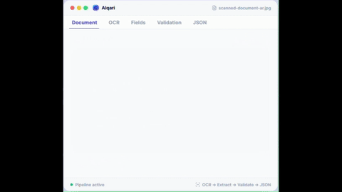
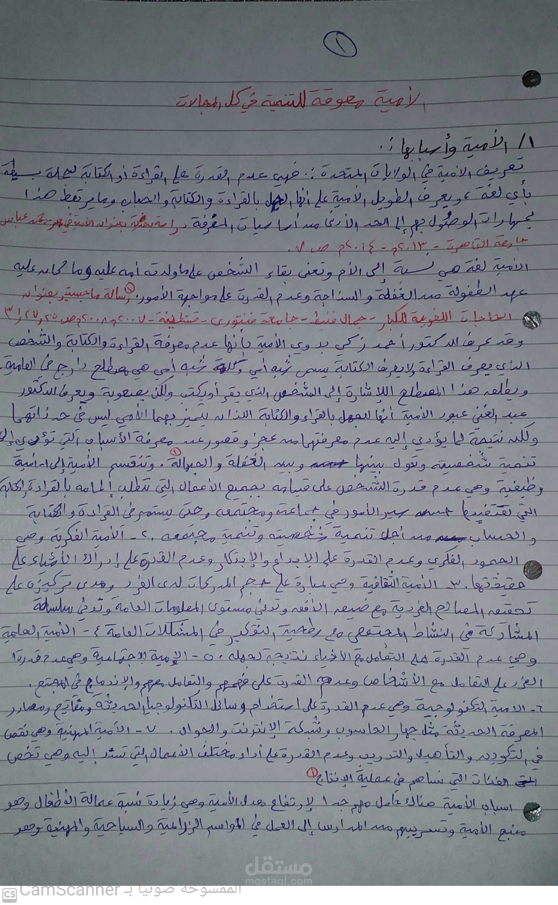

<div align="center">


# ALQari Developer Hub

**ALQari is an Arabic-first Document Intelligence API platform** — OCR, Arabic handwriting recognition, document extraction, validation, chat with documents, and structured JSON output, all over a single REST API.

[](https://github.com/AlQari-ai/.github/actions/workflows/validate-openapi.yml)
[](https://github.com/AlQari-ai/.github/actions/workflows/markdown-lint.yml)
[](https://github.com/AlQari-ai/.github/actions/workflows/test-examples.yml)
[](https://github.com/AlQari-ai/.github/actions/workflows/deploy-docs.yml)
[](openapi/openapi.yaml)
[](LICENSE)
[](CONTRIBUTING.md)

</div>

---



## Quickstart (3 steps)

### 1 — Get your API key

Sign up at **[alqari.sa](https://alqari.sa)** → **Dashboard** → **API Keys** → create a new key.

```bash
export ALQARI_API_KEY="your_api_key_here"
```

### 2 — Upload a document

```bash
curl -X POST https://api.alqari.sa/v1/documents \
  -H "Authorization: Bearer $ALQARI_API_KEY" \
  -F "file=@invoice.pdf"
```

```json
{
  "document_id": "doc_abc123",
  "status": "uploaded",
  "filename": "invoice.pdf"
}
```

### 3 — Run OCR and get structured output

```bash
curl -X POST https://api.alqari.sa/v1/documents/doc_abc123/ocr \
  -H "Authorization: Bearer $ALQARI_API_KEY" \
  -H "Content-Type: application/json" \
  -d '{"language": "ar"}'
```



Real response from a scanned Arabic document (`sample-ar-handwriting.jpg`, 398 words, processed in 5.4 s):

```json
{
  "document_id": "a5aa5d2b-c63d-4645-8ad3-8b142bcfb57c",
  "file_name": "sample-ar-handwriting.jpg",
  "status": "completed",
  "processing_time": 5.356,
  "total_words": 398,
  "download_urls": {
    "markdown": "https://api.alqari.sa/services/ocr-history/{document_id}/download/markdown",
    "html":     "https://api.alqari.sa/services/ocr-history/{document_id}/download/html",
    "ocr":      "https://api.alqari.sa/services/ocr-history/{document_id}/download/ocr"
  },
  "ocr_output": {
    "ocr": [
      {
        "text": "الأمية معوقة للتنمية في كل المجالات",
        "confidence": 0.7835,
        "bbox": [[614,298],[1494,298],[1494,394],[614,394]]
      },
      {
        "text": "١/ الأمية وأسبابها :.",
        "confidence": 0.7012,
        "bbox": [[1327,444],[1879,444],[1879,554],[1327,554]]
      }
    ]
  },
  "markdown": "## الأمية معوقة للتنمية في كل المجالات\n\n١/ الأمية وأسبابها :...\n",
  "metadata": { "pages": 1, "blocks": 9, "tables": 0, "figures": 0 }
}
```

That's it. The response includes per-block text with confidence scores, bounding boxes, structured layout data, and direct download URLs for Markdown, HTML, and raw OCR formats.

> Full sample output → [`examples/sample-output/ocr-response.json`](examples/sample-output/ocr-response.json)

---

## What ALQari Can Do

| Capability              | Description                                              |
|-------------------------|----------------------------------------------------------|
| **OCR**                 | Extract text from printed Arabic & English documents     |
| **Handwriting OCR**     | Recognize Arabic handwritten text                        |
| **Extraction**          | Pull structured fields (name, date, amount, ID, etc.)    |
| **Validation**          | Run business rules and human-in-the-loop workflows       |
| **Chat with Documents** | Ask questions in natural language over your documents    |
| **Search**              | Full-text and semantic search across document collections|
| **Webhooks**            | Receive real-time status updates on document processing  |

---

## Repository Structure

```
alqari-developer-hub/
├── docs/               # Full API reference and guides
├── openapi/            # OpenAPI 3.1 specification (JSON + YAML)
├── examples/
│   ├── curl/           # cURL one-liners for every endpoint
│   ├── python/         # Python examples using requests
│   └── node/           # Node.js examples using fetch
├── postman/            # Postman collection + environment
├── scripts/            # Developer utility scripts
└── .github/workflows/  # CI: OpenAPI validation, markdown lint
```

---

## Documentation

| Guide | Description |
|-------|-------------|
| [Quickstart](docs/quickstart.md) | Upload your first document in minutes |
| [Authentication](docs/authentication.md) | API key setup and Bearer token usage |
| [API Overview](docs/api-overview.md) | Endpoints, versioning, and base URL |
| [Upload Documents](docs/upload-documents.md) | Supported formats and upload options |
| [OCR](docs/ocr.md) | Printed and handwritten Arabic OCR |
| [Extraction](docs/extraction.md) | Structured field extraction |
| [Validation](docs/validation.md) | Validation workflows |
| [Chat](docs/chat.md) | Chat with your documents |
| [Search](docs/search.md) | Search across document collections |
| [Webhooks](docs/webhooks.md) | Real-time event notifications |
| [Errors](docs/errors.md) | Error codes and troubleshooting |
| [Rate Limits](docs/rate-limits.md) | Quotas and throttling |
| [Sandbox](docs/sandbox.md) | Test environment |
| [Security](docs/security.md) | Security practices |

---

## Code Examples

### Python

```python
import os, requests

API_KEY = os.environ["ALQARI_API_KEY"]
BASE_URL = "https://api.alqari.sa/v1"
HEADERS = {"Authorization": f"Bearer {API_KEY}"}

# Upload
with open("invoice.pdf", "rb") as f:
    resp = requests.post(f"{BASE_URL}/documents", headers=HEADERS, files={"file": f})
doc_id = resp.json()["document_id"]

# OCR
ocr = requests.post(f"{BASE_URL}/documents/{doc_id}/ocr",
                    headers=HEADERS, json={"language": "ar"})
print(ocr.json())
```

### Node.js

```js
import fetch from "node-fetch";
import FormData from "form-data";
import fs from "fs";

const BASE = "https://api.alqari.sa/v1";
const HEADERS = { Authorization: `Bearer ${process.env.ALQARI_API_KEY}` };

const form = new FormData();
form.append("file", fs.createReadStream("invoice.pdf"));

const upload = await fetch(`${BASE}/documents`, { method: "POST", headers: { ...HEADERS, ...form.getHeaders() }, body: form });
const { document_id } = await upload.json();

const ocr = await fetch(`${BASE}/documents/${document_id}/ocr`, {
  method: "POST",
  headers: { ...HEADERS, "Content-Type": "application/json" },
  body: JSON.stringify({ language: "ar" })
});
console.log(await ocr.json());
```

---

## OpenAPI Specification

The full OpenAPI 3.1 spec lives in [`openapi/`](openapi/). Import it into Postman, Insomnia, or any API client.

### Fetch the latest spec from the live API

**Install dependencies once:**

```bash
pip install requests pyyaml
```

**Run:**

```bash
python scripts/fetch-openapi.py
```

The script probes these URLs in order and uses the first valid OpenAPI document it finds:

```
https://api.alqari.sa/openapi.json
https://api.alqari.sa/api/openapi.json
https://api.alqari.sa/swagger.json
https://api.alqari.sa/docs/openapi.json
```

On success it writes `openapi/openapi.json` and `openapi/openapi.yaml`, then prints a summary:

```
========================================================
  OpenAPI Specification Summary
========================================================
  Title      : ALQari Document Intelligence API
  Version    : 1.0.0
  Paths      : 15
  Operations : 22
  Tags       : Documents, OCR, Extraction, Validation, Chat, Search, Webhooks
========================================================
```

If no spec is found, the script exits with a clear error listing every URL it tried.

> **`ALQARI_API_KEY`** is sent as a Bearer token when set, and is never printed or logged. The variable is optional for public spec endpoints.

---

## Postman

Import [`postman/alqari.postman_collection.json`](postman/alqari.postman_collection.json) and [`postman/alqari.postman_environment.json`](postman/alqari.postman_environment.json) into Postman, set `ALQARI_API_KEY`, and run any request immediately.

---

## Sandbox

Use base URL `https://sandbox.api.alqari.sa/v1` with sandbox credentials to test without affecting production data. See [docs/sandbox.md](docs/sandbox.md).

---

## Contributing

We welcome issues, corrections, and example contributions. See [CONTRIBUTING.md](CONTRIBUTING.md).

---

## Security

Do not commit API keys. See [SECURITY.md](SECURITY.md) for our responsible disclosure policy.

---

## License

[MIT](LICENSE) © ALQari
- Webhooks Guide
- Sandbox Environment

## Website

https://alqari.sa
